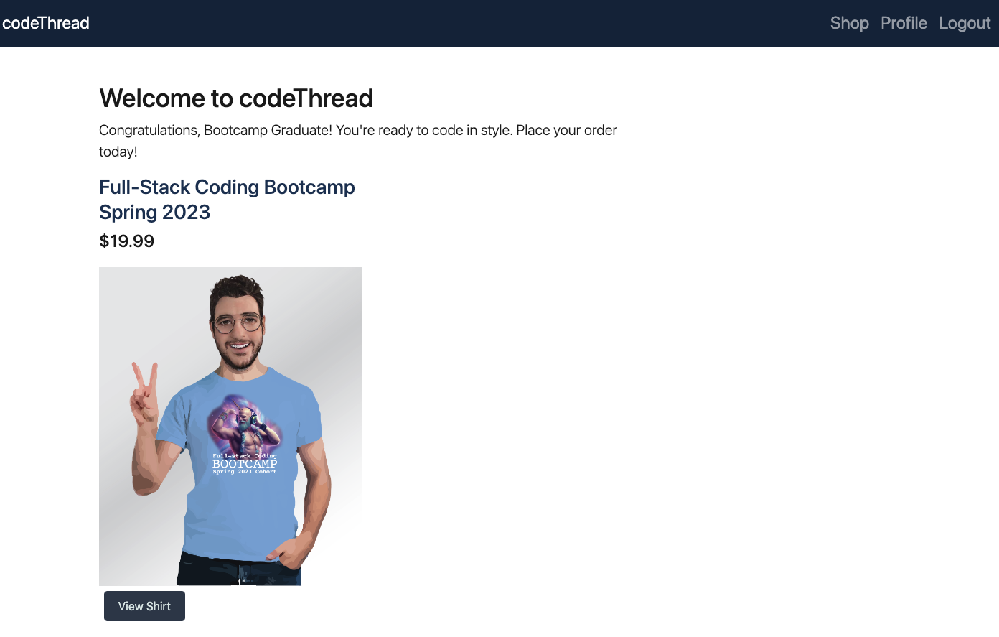
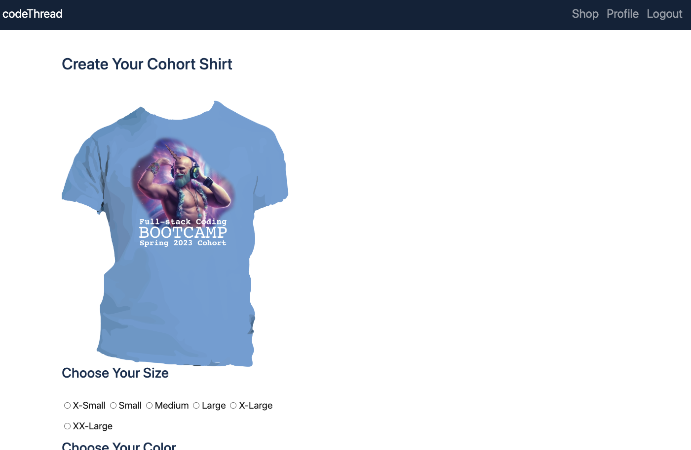
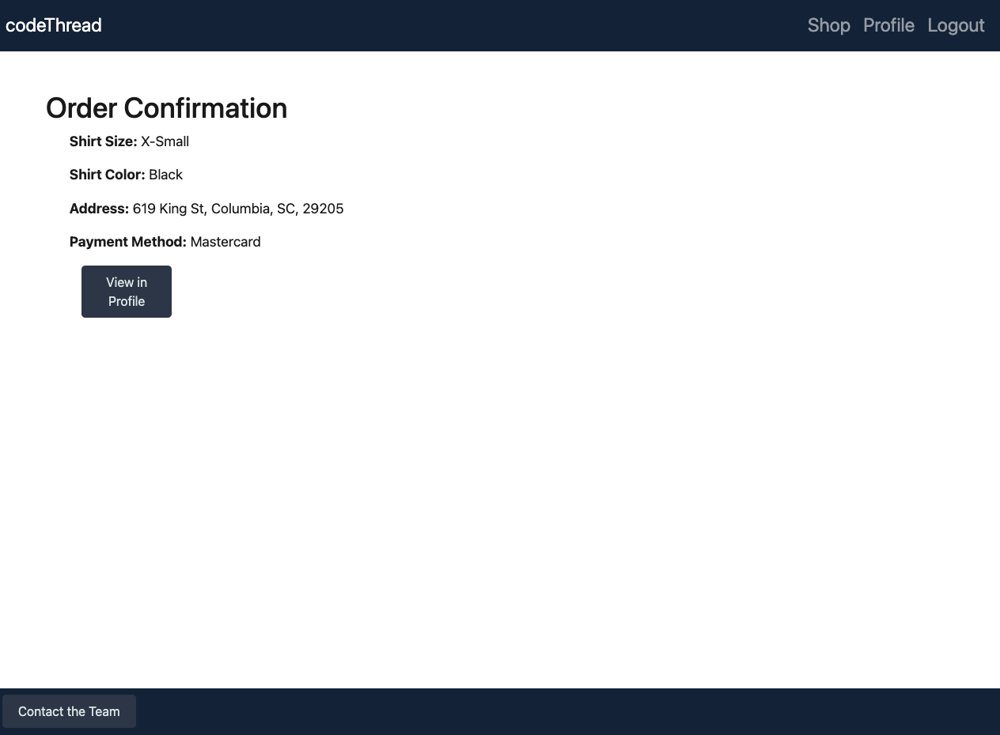
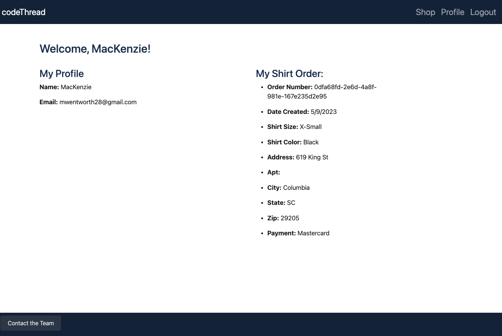

# Code Thread


## Application Links

* GitHub Repository for Application: https://github.com/pexApred/CodeThread

* Heroku Deployed Application: 

---

## Description

### *The Task*

For Project #2, we were tasked to utilize the skills and knowledge we've gained through the Coding Bootcamp and work in a group to create a real-world full-stack web application from scratch.

### *Our Project*
A website where Bootcamp graduates can create an account to purchase their own cohort t-shirt by selecting a cohort, shirt size, and shirt color.

Show off your cohort pride with custom-designed apparel from us! With our unique, stylish designs and comfortable materials, we provide the perfect way to express yourself and commemorate your hard-earned accomplishments. Plus, we use eco-friendly materials, so you can feel good about your purchase. So don’t wait – join thousands of other graduates and show off your cohort pride in style today!

### *Motivation for Development*
Our motivation was our awesome cohort and wanting to create a product where we can express all of our accomplishments and cohort pride!

---

## Table of Contents

- [User Story](#user-story)
- [Acceptance Criteria](#acceptance-criteria)
- [Usage](#usage)
- [Technologies Used](#technologies-used)
- [Credits](#credits)
- [License](#license)
- [Badges](#badges)
---

## User Story

```md
AS A bootcamp student, 
I WANT to access a website that will allow me to input information and purchase a bootcamp shirt
SO THAT I can represent UNC Fullstack Coding Bootcamp
```

## Acceptance Criteria

```md
GIVEN I visit the Code Thread webpage
WHEN I access the homepage by clicking on 'codeThread' at the top of the application
THEN I am taken to the 'Shop' page, which is also the homepage of the application
WHEN I click on the 'Shop' option from the navbar
THEN I am taken to a selection of cohort shirts to choose from 
WHEN I click on the 'Login' option from the navbar
THEN I am presented with a login form and signup form
WHEN I see a login screen and an option to signup 
THEN I login with my existing credentials or login by signing up to create a new profile
WHEN I click a button to select a shirt from the 'Shop' page but am not yet logged in
THEN I am taken to the login page to login or signup
WHEN I am logged in and click a button to select a shirt from the 'Shop' page
THEN I am taken to a page with a shirt-order form
WHEN I choose my shirt size, shirt color, payment method, and input my delivery address on the shirt-order form
THEN I see an order confirmation for my selected shirt and a button to view my order in my 'Profile'
WHEN I click on the 'Profile' option from the navbar
THEN I am taken to a page with my user details including my name and email, as well as my shirt order
WHEN I am presented with my shirt order on my 'Profile' page
THEN I see an order number with the date created, shirt color, shirt size, address, and payment method
WHEN I click the 'Logout' option from the navbar
THEN I am taken back to the 'Shop' homepage
WHEN I click the button to 'Contact the Team' at the bottom of the application
THEN I am presented with a modal containing the Code Thread email
```


## Usage







## Technologies Used

* [VS Code](https://code.visualstudio.com/)
* [Node.js](https://nodejs.org/en)
* [Node Package Manager](https://www.npmjs.com/)
* [UUID](https://www.npmjs.com/package/uuid)
* [Express](https://expressjs.com/)
* [Faker.js](https://www.npmjs.com/package/@faker-js/faker)
* [MySQL](https://www.mysql.com/)
* [Sequelize](https://www.npmjs.com/package/sequelize)
* [Handlebars.js](https://www.npmjs.com/package/handlebars)
* [Heroku](https://www.heroku.com/)


## Credits

Jasmina Otero, Daniel Bowen, MacKenzie Wentworth, Erynn Affeldt, Emmanuel Lakis


## License
This project is covered under the [MIT License](./LICENSE). For more details, please click the license icon below under 'Badges'.

---

## Badges

[](https://opensource.org/licenses/MIT)


